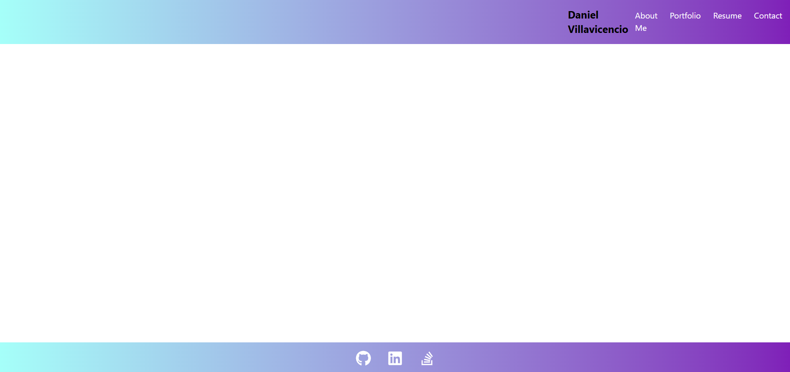

# danielv-portal

## Description
A personal online portfolio built using vite and react and styled using tailwindCSS

## Installation
Simply visit my site at https://voluble-scone-1830ad.netlify.app/

## Usage
I use this project by adding different projects and resources to the code and use my tailwind css to render them dynamically

## Contributing
others can contribute by supplying feedback on my contact page

## Screenshot

## Questions
For questions, please contact me via:
- GitHub: [dvilla-exe](https://github.com/dvilla-exe)
- Email: d.villa.exe@gmail.com
